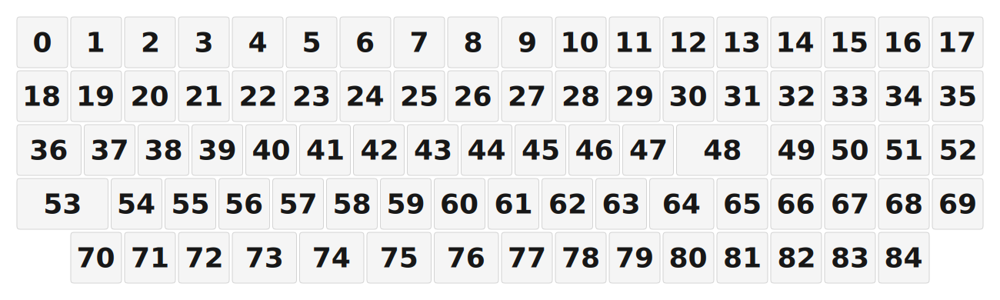

# ZMK Configuration for N3V4

*Generated by Shield Wizard for ZMK*



Download compiled firmware from the Actions tab. <https://zmk.dev/docs/user-setup#installing-the-firmware>

Edit your keymap <https://zmk.dev/docs/keymaps>.
User keymap is located at [`config/n3v4.keymap`](config/n3v4.keymap).

-----

<details>
<summary>
Shield Wizard Debug Information
</summary>

In case of broken configuration, here is the Shield Wizard internal data used to generate this configuration:

Commit: 8a52249f61161469b6d90ed8c80c4aa52b9f3858

```json
{"name":"N3V4","shield":"n3v4","dongle":false,"modules":[],"layout":[{"id":"01KHSPT36EKS0DSP3PSNANAZCR","part":0,"row":0,"col":0,"w":1,"h":1,"x":0,"y":0,"r":0,"rx":0,"ry":0},{"id":"01KHSPT36E73VWSTZT3XHP6JWX","part":0,"row":0,"col":1,"w":1,"h":1,"x":1,"y":0,"r":0,"rx":0,"ry":0},{"id":"01KHSPT36EACJQ5TKR1A5ANMZZ","part":0,"row":0,"col":2,"w":1,"h":1,"x":2,"y":0,"r":0,"rx":0,"ry":0},{"id":"01KHSPT36EH2HVMMEKDNB5AB86","part":0,"row":0,"col":3,"w":1,"h":1,"x":3,"y":0,"r":0,"rx":0,"ry":0},{"id":"01KHSPT36ES76TAK83EHQT2E27","part":0,"row":0,"col":4,"w":1,"h":1,"x":4,"y":0,"r":0,"rx":0,"ry":0},{"id":"01KHSPT36ESZ8A81RBSQBKQYY3","part":0,"row":0,"col":5,"w":1,"h":1,"x":5,"y":0,"r":0,"rx":0,"ry":0},{"id":"01KHSPT36E0ZE51DQDY0QV3P7Q","part":0,"row":0,"col":6,"w":1,"h":1,"x":6,"y":0,"r":0,"rx":0,"ry":0},{"id":"01KHSPT36EWKTPV7DKHGTVNJT1","part":0,"row":0,"col":7,"w":1,"h":1,"x":7,"y":0,"r":0,"rx":0,"ry":0},{"id":"01KHSPT36EEG58RRGEMEBPVWR1","part":0,"row":0,"col":8,"w":1,"h":1,"x":8,"y":0,"r":0,"rx":0,"ry":0},{"id":"01KHSPT36E7N3EMN1ENF6VSTMS","part":0,"row":0,"col":9,"w":1,"h":1,"x":9,"y":0,"r":0,"rx":0,"ry":0},{"id":"01KHSPT36EMY2W8RM7CJ9VGXQR","part":0,"row":0,"col":10,"w":1,"h":1,"x":10,"y":0,"r":0,"rx":0,"ry":0},{"id":"01KHSPT36ET58AMZFFF8Q7CTJK","part":0,"row":0,"col":11,"w":1,"h":1,"x":11,"y":0,"r":0,"rx":0,"ry":0},{"id":"01KHSPT36E6BE0T1RBDGE098YV","part":0,"row":0,"col":12,"w":1,"h":1,"x":12,"y":0,"r":0,"rx":0,"ry":0},{"id":"01KHSPT36E2BEQ798B2VNHWD7Q","part":0,"row":0,"col":13,"w":1,"h":1,"x":13,"y":0,"r":0,"rx":0,"ry":0},{"id":"01KHSPT36E7911ZXA8ZDHVM9C9","part":0,"row":0,"col":14,"w":1,"h":1,"x":14,"y":0,"r":0,"rx":0,"ry":0},{"id":"01KHSPT36E43NE2C8BCNSQ9FPJ","part":0,"row":0,"col":15,"w":1,"h":1,"x":15,"y":0,"r":0,"rx":0,"ry":0},{"id":"01KHSPT36E7SNPYSZNXRM7G13F","part":0,"row":0,"col":16,"w":1,"h":1,"x":16,"y":0,"r":0,"rx":0,"ry":0},{"id":"01KHSPT36ENGHWC65Y6EMESVHC","part":0,"row":0,"col":17,"w":1,"h":1,"x":17,"y":0,"r":0,"rx":0,"ry":0},{"id":"01KHSPT36EZZ1SXPNG861VQXWF","part":0,"row":1,"col":0,"w":1,"h":1,"x":0,"y":1,"r":0,"rx":0,"ry":0},{"id":"01KHSPT36E9KGRW0412G6A0G8T","part":0,"row":1,"col":1,"w":1,"h":1,"x":1,"y":1,"r":0,"rx":0,"ry":0},{"id":"01KHSPT36EZZ2XA3K2AMDE5R4B","part":0,"row":1,"col":2,"w":1,"h":1,"x":2,"y":1,"r":0,"rx":0,"ry":0},{"id":"01KHSPT36EE1M3DHVC9DTNHYAA","part":0,"row":1,"col":3,"w":1,"h":1,"x":3,"y":1,"r":0,"rx":0,"ry":0},{"id":"01KHSPT36EEW36PFHVVPV4A9VT","part":0,"row":1,"col":4,"w":1,"h":1,"x":4,"y":1,"r":0,"rx":0,"ry":0},{"id":"01KHSPT36EPGQHTJZ9JTD1MRME","part":0,"row":1,"col":5,"w":1,"h":1,"x":5,"y":1,"r":0,"rx":0,"ry":0},{"id":"01KHSPT36EM1YKQ7PQ4RJA0MX3","part":0,"row":1,"col":6,"w":1,"h":1,"x":6,"y":1,"r":0,"rx":0,"ry":0},{"id":"01KHSPT36E4BP91EYH9C0C8XGC","part":0,"row":1,"col":7,"w":1,"h":1,"x":7,"y":1,"r":0,"rx":0,"ry":0},{"id":"01KHSPT36ERR78NEQQ5K1TQ4FD","part":0,"row":1,"col":8,"w":1,"h":1,"x":8,"y":1,"r":0,"rx":0,"ry":0},{"id":"01KHSPT36EJRY9YC196BGYRMEE","part":0,"row":1,"col":9,"w":1,"h":1,"x":9,"y":1,"r":0,"rx":0,"ry":0},{"id":"01KHSPT36EJ8758RCGB0ET6K7J","part":0,"row":1,"col":10,"w":1,"h":1,"x":10,"y":1,"r":0,"rx":0,"ry":0},{"id":"01KHSPT36ETMY3PZKZAQ8JVNAA","part":0,"row":1,"col":11,"w":1,"h":1,"x":11,"y":1,"r":0,"rx":0,"ry":0},{"id":"01KHSPT36EHTKD6CXE3SCC8E9J","part":0,"row":1,"col":12,"w":1,"h":1,"x":12,"y":1,"r":0,"rx":0,"ry":0},{"id":"01KHSPT36ESHE2QV0CKSYQ2MJD","part":0,"row":1,"col":13,"w":1,"h":1,"x":13,"y":1,"r":0,"rx":0,"ry":0},{"id":"01KHSPT36E7ZPMP21QNYNYJEAW","part":0,"row":1,"col":14,"w":1,"h":1,"x":14,"y":1,"r":0,"rx":0,"ry":0},{"id":"01KHSPT36EZAWSVH31WY28K6B6","part":0,"row":1,"col":15,"w":1,"h":1,"x":15,"y":1,"r":0,"rx":0,"ry":0},{"id":"01KHSPT36ERG4BY7XNJTN50K3T","part":0,"row":1,"col":16,"w":1,"h":1,"x":16,"y":1,"r":0,"rx":0,"ry":0},{"id":"01KHSPT36EPHK1B6A44RCBFPKW","part":0,"row":1,"col":17,"w":1,"h":1,"x":17,"y":1,"r":0,"rx":0,"ry":0},{"id":"01KHSPT36EGWKFG9TDXAWWSS0P","part":0,"row":2,"col":0,"w":1.25,"h":1,"x":0,"y":2,"r":0,"rx":0,"ry":0},{"id":"01KHSPT36ETCQVTTKX33YSE4A0","part":0,"row":2,"col":1,"w":1,"h":1,"x":1.25,"y":2,"r":0,"rx":0,"ry":0},{"id":"01KHSPT36EPRRD4H3GJ7M3VX6B","part":0,"row":2,"col":2,"w":1,"h":1,"x":2.25,"y":2,"r":0,"rx":0,"ry":0},{"id":"01KHSPT36ETPF1RSJBS8YKJEB8","part":0,"row":2,"col":3,"w":1,"h":1,"x":3.25,"y":2,"r":0,"rx":0,"ry":0},{"id":"01KHSPT36EK4X4KHS6VQJD0HAS","part":0,"row":2,"col":4,"w":1,"h":1,"x":4.25,"y":2,"r":0,"rx":0,"ry":0},{"id":"01KHSPT36EA2EFYEHD6VQNNW75","part":0,"row":2,"col":5,"w":1,"h":1,"x":5.25,"y":2,"r":0,"rx":0,"ry":0},{"id":"01KHSPT36ESC40CTSSRW6H7QRB","part":0,"row":2,"col":6,"w":1,"h":1,"x":6.25,"y":2,"r":0,"rx":0,"ry":0},{"id":"01KHSPT36FYVTC5H85BAX8V16Z","part":0,"row":2,"col":7,"w":1,"h":1,"x":7.25,"y":2,"r":0,"rx":0,"ry":0},{"id":"01KHSPT36FCS0F01EZQ1S43YA5","part":0,"row":2,"col":8,"w":1,"h":1,"x":8.25,"y":2,"r":0,"rx":0,"ry":0},{"id":"01KHSPT36F3RQFQ3EQ1PM3E2QG","part":0,"row":2,"col":9,"w":1,"h":1,"x":9.25,"y":2,"r":0,"rx":0,"ry":0},{"id":"01KHSPT36F019RGP11Z1TKFTX6","part":0,"row":2,"col":10,"w":1,"h":1,"x":10.25,"y":2,"r":0,"rx":0,"ry":0},{"id":"01KHSPT36FC6A1CFD801RJN1S6","part":0,"row":2,"col":11,"w":1,"h":1,"x":11.25,"y":2,"r":0,"rx":0,"ry":0},{"id":"01KHSPT36FYDD4MRB1G1YKXET9","part":0,"row":2,"col":12,"w":1.75,"h":1,"x":12.25,"y":2,"r":0,"rx":0,"ry":0},{"id":"01KHSPT36FD4A58MWAPQHR43VX","part":0,"row":2,"col":14,"w":1,"h":1,"x":14,"y":2,"r":0,"rx":0,"ry":0},{"id":"01KHSPT36FHY0PYETCZ7N3Q5ZR","part":0,"row":2,"col":15,"w":1,"h":1,"x":15,"y":2,"r":0,"rx":0,"ry":0},{"id":"01KHSPT36FZ60EMHMG0DKQVJKZ","part":0,"row":2,"col":16,"w":1,"h":1,"x":16,"y":2,"r":0,"rx":0,"ry":0},{"id":"01KHSPT36F9X94AW40R9E5K9XY","part":0,"row":2,"col":17,"w":1,"h":1,"x":17,"y":2,"r":0,"rx":0,"ry":0},{"id":"01KHSPT36FKATSPJJW06RZRHM2","part":0,"row":3,"col":0,"w":1.75,"h":1,"x":0,"y":3,"r":0,"rx":0,"ry":0},{"id":"01KHSPT36F1PW3JW3QWWGPH2YA","part":0,"row":3,"col":1,"w":1,"h":1,"x":1.75,"y":3,"r":0,"rx":0,"ry":0},{"id":"01KHSPT36FD57ZK21BMKDZYW8V","part":0,"row":3,"col":2,"w":1,"h":1,"x":2.75,"y":3,"r":0,"rx":0,"ry":0},{"id":"01KHSPT36F3X9CHA2FBSJ5HP5H","part":0,"row":3,"col":3,"w":1,"h":1,"x":3.75,"y":3,"r":0,"rx":0,"ry":0},{"id":"01KHSPT36F63XG3TAJ6JHPZGE3","part":0,"row":3,"col":4,"w":1,"h":1,"x":4.75,"y":3,"r":0,"rx":0,"ry":0},{"id":"01KHSPT36F22FE908R4N7S1EZM","part":0,"row":3,"col":5,"w":1,"h":1,"x":5.75,"y":3,"r":0,"rx":0,"ry":0},{"id":"01KHSPT36FDG0QAP78GCV2FYEZ","part":0,"row":3,"col":6,"w":1,"h":1,"x":6.75,"y":3,"r":0,"rx":0,"ry":0},{"id":"01KHSPT36F6A06XA1X8TQAJ0SD","part":0,"row":3,"col":7,"w":1,"h":1,"x":7.75,"y":3,"r":0,"rx":0,"ry":0},{"id":"01KHSPT36FP4XMQZSBP1V2CP7B","part":0,"row":3,"col":8,"w":1,"h":1,"x":8.75,"y":3,"r":0,"rx":0,"ry":0},{"id":"01KHSPT36FGN84NC0DCW8X1FZ2","part":0,"row":3,"col":9,"w":1,"h":1,"x":9.75,"y":3,"r":0,"rx":0,"ry":0},{"id":"01KHSPT36FS2YB0S0ZG52EP8Q8","part":0,"row":3,"col":10,"w":1,"h":1,"x":10.75,"y":3,"r":0,"rx":0,"ry":0},{"id":"01KHSPT36F5HZ0B9ARAN3BMVG0","part":0,"row":3,"col":11,"w":1.25,"h":1,"x":11.75,"y":3,"r":0,"rx":0,"ry":0},{"id":"01KHSPT36FCYY4K0EXBCP2RB3Y","part":0,"row":3,"col":13,"w":1,"h":1,"x":13,"y":3,"r":0,"rx":0,"ry":0},{"id":"01KHSPT36FEH0APDH8HRXQEXK0","part":0,"row":3,"col":14,"w":1,"h":1,"x":14,"y":3,"r":0,"rx":0,"ry":0},{"id":"01KHSPT36FGK7Z01WQAPPSZNNF","part":0,"row":3,"col":15,"w":1,"h":1,"x":15,"y":3,"r":0,"rx":0,"ry":0},{"id":"01KHSPT36FQES5B2TVJ6G30B1Q","part":0,"row":3,"col":16,"w":1,"h":1,"x":16,"y":3,"r":0,"rx":0,"ry":0},{"id":"01KHSPT36FE3M4ZYPN8CFZM9MN","part":0,"row":3,"col":17,"w":1,"h":1,"x":17,"y":3,"r":0,"rx":0,"ry":0},{"id":"01KHSPT36FXWVSSS7KJE5C7Z17","part":0,"row":4,"col":1,"w":1,"h":1,"x":1,"y":4,"r":0,"rx":0,"ry":0},{"id":"01KHSPT36FQ4H3HAFJ7T0ZZ3S1","part":0,"row":4,"col":2,"w":1,"h":1,"x":2,"y":4,"r":0,"rx":0,"ry":0},{"id":"01KHSPT36F63REYCTF59TAC37E","part":0,"row":4,"col":3,"w":1,"h":1,"x":3,"y":4,"r":0,"rx":0,"ry":0},{"id":"01KHSPT36FR15QDGS9ZNV5Y8C3","part":0,"row":4,"col":4,"w":1.25,"h":1,"x":4,"y":4,"r":0,"rx":0,"ry":0},{"id":"01KHSPT36FC45ABR5XBZMA9G10","part":0,"row":4,"col":5,"w":1.25,"h":1,"x":5.25,"y":4,"r":0,"rx":0,"ry":0},{"id":"01KHSPT36F0EB470NCSJ6RKF1M","part":0,"row":4,"col":6,"w":1.25,"h":1,"x":6.5,"y":4,"r":0,"rx":0,"ry":0},{"id":"01KHSPT36FASJ3378NZN2HP77Z","part":0,"row":4,"col":7,"w":1.25,"h":1,"x":7.75,"y":4,"r":0,"rx":0,"ry":0},{"id":"01KHSPT36FKQM6XDWEW99W27PZ","part":0,"row":4,"col":9,"w":1,"h":1,"x":9,"y":4,"r":0,"rx":0,"ry":0},{"id":"01KHSPT36F0V7B1CD86B2PR4VA","part":0,"row":4,"col":10,"w":1,"h":1,"x":10,"y":4,"r":0,"rx":0,"ry":0},{"id":"01KHSPT36F9EAVWQDS8P53M2ZA","part":0,"row":4,"col":11,"w":1,"h":1,"x":11,"y":4,"r":0,"rx":0,"ry":0},{"id":"01KHSPT36F7RNFA2M61PJEB5FG","part":0,"row":4,"col":12,"w":1,"h":1,"x":12,"y":4,"r":0,"rx":0,"ry":0},{"id":"01KHSPT36F6ARQSDND03Z227X1","part":0,"row":4,"col":13,"w":1,"h":1,"x":13,"y":4,"r":0,"rx":0,"ry":0},{"id":"01KHSPT36FHMA3XCN1CTHAA49S","part":0,"row":4,"col":14,"w":1,"h":1,"x":14,"y":4,"r":0,"rx":0,"ry":0},{"id":"01KHSPT36F2KA0J5GX2JSGZ2KB","part":0,"row":4,"col":15,"w":1,"h":1,"x":15,"y":4,"r":0,"rx":0,"ry":0},{"id":"01KHSPT36FB37SSW3K74KKB2AH","part":0,"row":4,"col":16,"w":1,"h":1,"x":16,"y":4,"r":0,"rx":0,"ry":0}],"parts":[{"name":"unibody","controller":"rpi_pico","wiring":"matrix_diode","pins":{"gp5":"input","gp4":"input","gp3":"input","gp2":"input","gp1":"input","gp6":"output","gp7":"output","gp8":"output","gp9":"output","gp10":"output","gp11":"output","gp12":"output","gp13":"output","gp14":"output","gp15":"output","gp16":"output","gp17":"output","gp18":"output","gp19":"output","gp20":"output","gp21":"output","gp22":"output","gp26":"output"},"keys":{"01KHSPT36FXWVSSS7KJE5C7Z17":{"input":"gp5","output":"gp7"},"01KHSPT36FQ4H3HAFJ7T0ZZ3S1":{"input":"gp5","output":"gp8"},"01KHSPT36FC45ABR5XBZMA9G10":{"input":"gp5","output":"gp11"},"01KHSPT36F0EB470NCSJ6RKF1M":{"input":"gp5","output":"gp12"},"01KHSPT36FASJ3378NZN2HP77Z":{"input":"gp5","output":"gp13"},"01KHSPT36FKQM6XDWEW99W27PZ":{"input":"gp5","output":"gp15"},"01KHSPT36F0V7B1CD86B2PR4VA":{"input":"gp5","output":"gp16"},"01KHSPT36F9EAVWQDS8P53M2ZA":{"input":"gp5","output":"gp17"},"01KHSPT36F7RNFA2M61PJEB5FG":{"input":"gp5","output":"gp18"},"01KHSPT36F6ARQSDND03Z227X1":{"input":"gp5","output":"gp19"},"01KHSPT36FHMA3XCN1CTHAA49S":{"input":"gp5","output":"gp20"},"01KHSPT36F2KA0J5GX2JSGZ2KB":{"input":"gp5","output":"gp21"},"01KHSPT36FB37SSW3K74KKB2AH":{"input":"gp5","output":"gp22"},"01KHSPT36FKATSPJJW06RZRHM2":{"input":"gp4","output":"gp6"},"01KHSPT36F1PW3JW3QWWGPH2YA":{"input":"gp4","output":"gp7"},"01KHSPT36FD57ZK21BMKDZYW8V":{"input":"gp4","output":"gp8"},"01KHSPT36F3X9CHA2FBSJ5HP5H":{"input":"gp4","output":"gp9"},"01KHSPT36F63XG3TAJ6JHPZGE3":{"input":"gp4","output":"gp10"},"01KHSPT36F22FE908R4N7S1EZM":{"input":"gp4","output":"gp11"},"01KHSPT36FDG0QAP78GCV2FYEZ":{"input":"gp4","output":"gp12"},"01KHSPT36F6A06XA1X8TQAJ0SD":{"input":"gp4","output":"gp13"},"01KHSPT36FP4XMQZSBP1V2CP7B":{"input":"gp4","output":"gp14"},"01KHSPT36FGN84NC0DCW8X1FZ2":{"input":"gp4","output":"gp15"},"01KHSPT36FS2YB0S0ZG52EP8Q8":{"input":"gp4","output":"gp16"},"01KHSPT36F5HZ0B9ARAN3BMVG0":{"input":"gp4","output":"gp18"},"01KHSPT36FCYY4K0EXBCP2RB3Y":{"input":"gp4","output":"gp19"},"01KHSPT36FEH0APDH8HRXQEXK0":{"input":"gp4","output":"gp20"},"01KHSPT36FGK7Z01WQAPPSZNNF":{"input":"gp4","output":"gp21"},"01KHSPT36FQES5B2TVJ6G30B1Q":{"input":"gp4","output":"gp22"},"01KHSPT36FE3M4ZYPN8CFZM9MN":{"input":"gp4","output":"gp26"},"01KHSPT36EGWKFG9TDXAWWSS0P":{"input":"gp3","output":"gp6"},"01KHSPT36ETCQVTTKX33YSE4A0":{"input":"gp3","output":"gp7"},"01KHSPT36EPRRD4H3GJ7M3VX6B":{"input":"gp3","output":"gp8"},"01KHSPT36ETPF1RSJBS8YKJEB8":{"input":"gp3","output":"gp9"},"01KHSPT36EK4X4KHS6VQJD0HAS":{"input":"gp3","output":"gp10"},"01KHSPT36EA2EFYEHD6VQNNW75":{"input":"gp3","output":"gp11"},"01KHSPT36ESC40CTSSRW6H7QRB":{"input":"gp3","output":"gp12"},"01KHSPT36FYVTC5H85BAX8V16Z":{"input":"gp3","output":"gp13"},"01KHSPT36FCS0F01EZQ1S43YA5":{"input":"gp3","output":"gp14"},"01KHSPT36F3RQFQ3EQ1PM3E2QG":{"input":"gp3","output":"gp15"},"01KHSPT36F019RGP11Z1TKFTX6":{"input":"gp3","output":"gp16"},"01KHSPT36FC6A1CFD801RJN1S6":{"input":"gp3","output":"gp17"},"01KHSPT36FYDD4MRB1G1YKXET9":{"input":"gp3","output":"gp19"},"01KHSPT36FD4A58MWAPQHR43VX":{"input":"gp3","output":"gp20"},"01KHSPT36FHY0PYETCZ7N3Q5ZR":{"input":"gp3","output":"gp21"},"01KHSPT36FZ60EMHMG0DKQVJKZ":{"input":"gp3","output":"gp22"},"01KHSPT36F9X94AW40R9E5K9XY":{"input":"gp3","output":"gp26"},"01KHSPT36EZZ1SXPNG861VQXWF":{"input":"gp2","output":"gp6"},"01KHSPT36E9KGRW0412G6A0G8T":{"input":"gp2","output":"gp7"},"01KHSPT36EZZ2XA3K2AMDE5R4B":{"input":"gp2","output":"gp8"},"01KHSPT36EE1M3DHVC9DTNHYAA":{"input":"gp2","output":"gp9"},"01KHSPT36EEW36PFHVVPV4A9VT":{"input":"gp2","output":"gp10"},"01KHSPT36EPGQHTJZ9JTD1MRME":{"input":"gp2","output":"gp11"},"01KHSPT36EM1YKQ7PQ4RJA0MX3":{"input":"gp2","output":"gp12"},"01KHSPT36E4BP91EYH9C0C8XGC":{"input":"gp2","output":"gp13"},"01KHSPT36ERR78NEQQ5K1TQ4FD":{"input":"gp2","output":"gp14"},"01KHSPT36EJRY9YC196BGYRMEE":{"input":"gp2","output":"gp15"},"01KHSPT36EJ8758RCGB0ET6K7J":{"input":"gp2","output":"gp16"},"01KHSPT36ETMY3PZKZAQ8JVNAA":{"input":"gp2","output":"gp17"},"01KHSPT36EHTKD6CXE3SCC8E9J":{"input":"gp2","output":"gp18"},"01KHSPT36ESHE2QV0CKSYQ2MJD":{"input":"gp2","output":"gp19"},"01KHSPT36E7ZPMP21QNYNYJEAW":{"input":"gp2","output":"gp20"},"01KHSPT36EZAWSVH31WY28K6B6":{"input":"gp2","output":"gp21"},"01KHSPT36ERG4BY7XNJTN50K3T":{"input":"gp2","output":"gp22"},"01KHSPT36EPHK1B6A44RCBFPKW":{"input":"gp2","output":"gp26"},"01KHSPT36F63REYCTF59TAC37E":{"input":"gp5","output":"gp9"},"01KHSPT36FR15QDGS9ZNV5Y8C3":{"input":"gp5","output":"gp10"},"01KHSPT36EKS0DSP3PSNANAZCR":{"input":"gp1","output":"gp6"},"01KHSPT36E73VWSTZT3XHP6JWX":{"input":"gp1","output":"gp7"},"01KHSPT36EACJQ5TKR1A5ANMZZ":{"input":"gp1","output":"gp8"},"01KHSPT36EH2HVMMEKDNB5AB86":{"input":"gp1","output":"gp9"},"01KHSPT36ES76TAK83EHQT2E27":{"input":"gp1","output":"gp10"},"01KHSPT36ESZ8A81RBSQBKQYY3":{"input":"gp1","output":"gp11"},"01KHSPT36E0ZE51DQDY0QV3P7Q":{"input":"gp1","output":"gp12"},"01KHSPT36EWKTPV7DKHGTVNJT1":{"input":"gp1","output":"gp13"},"01KHSPT36EEG58RRGEMEBPVWR1":{"input":"gp1","output":"gp14"},"01KHSPT36E7N3EMN1ENF6VSTMS":{"input":"gp1","output":"gp15"},"01KHSPT36EMY2W8RM7CJ9VGXQR":{"input":"gp1","output":"gp16"},"01KHSPT36ET58AMZFFF8Q7CTJK":{"input":"gp1","output":"gp17"},"01KHSPT36E6BE0T1RBDGE098YV":{"input":"gp1","output":"gp18"},"01KHSPT36E2BEQ798B2VNHWD7Q":{"input":"gp1","output":"gp19"},"01KHSPT36E7911ZXA8ZDHVM9C9":{"input":"gp1","output":"gp20"},"01KHSPT36E43NE2C8BCNSQ9FPJ":{"input":"gp1","output":"gp21"},"01KHSPT36E7SNPYSZNXRM7G13F":{"input":"gp1","output":"gp22"},"01KHSPT36ENGHWC65Y6EMESVHC":{"input":"gp1","output":"gp26"}},"encoders":[],"buses":[{"name":"spi0","devices":[],"type":"spi"},{"name":"spi1","devices":[],"type":"spi"},{"name":"i2c0","devices":[],"type":"i2c"},{"name":"i2c1","devices":[],"type":"i2c"}]}]}
```

</details>
